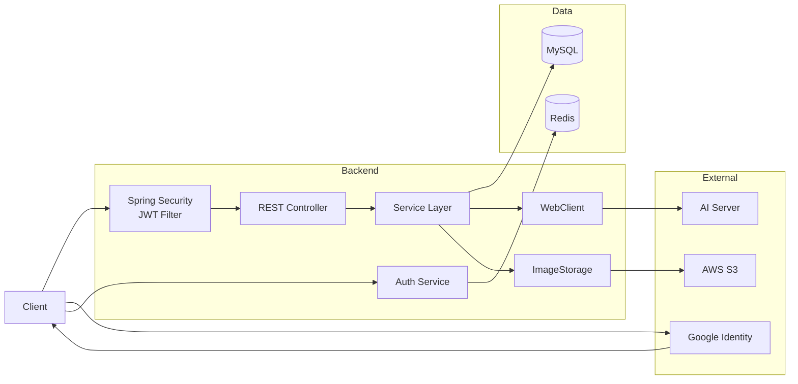

<div align="center">

# Recopo Backend

<b><i>Recopo - Design your idea</i></b>

</div>


Recopo는 개발 아이디어를 기록하고, 공유하며, AI를 통해 발전시킬 수 있는 아이디어 아카이빙 서비스입니다.  

사용자는 Brainstorming Card에 자신의 프로젝트 아이디어를 자유롭게 작성하고 저장할 수 있으며, AI를 통해 아이디어와 관련된 GitHub Repository를 추천받을 수 있습니다. 또한 친구와 아이디어를 공유하고 좋아요, 댓글, 알림 기능을 통해 다양한 피드백을 주고받으며 아이디어를 더욱 구체화할 수 있습니다.

`#바이브코딩` `#아카이빙` `#AI레포추천` `#친구공유`


## Key Features

- Brainstorming Card: 개발 아이디어 작성 및 아카이빙
- AI Repository Recommendation: 아이디어 기반 GitHub Repository 추천
- Idea Management: 추천 Repository 및 프로젝트 아이디어 저장
- Friend & Sharing: 친구 관계 관리 및 아이디어 공유
- Like & Comment: 좋아요와 댓글을 통한 피드백
- Notification: 사용자 활동 기반 알림
- Google Login & JWT Authentication: Google Social Login 및 JWT 기반 인증


## Technical Stack

### Backend


### Database


### Infrastructure & DevOps


### Tools


## Backend Highlights

### AI Recommendation Integration

Spring `WebClient`를 이용하여 Recopo Backend와 AI Recommendation Server를 연동합니다.

```text
Brainstorming Card
        ↓
Recopo Backend
        ↓
WebClient
        ↓
AI Recommendation Server
        ↓
Recommendation Result
        ↓
Recopo Backend
        ↓
MySQL
```

Backend에서 Card 데이터를 조회하여 AI Server에 전달하고, 추천된 GitHub Repository와 추천 결과를 DB에 저장합니다.


## Project Structure

```text
src/main/java/com/barcode/recopo
│
├── auth/               # Authentication, Google Login, Refresh Token
├── card/               # Brainstorming Card
├── comment/            # Comment
├── friend/             # Friend relationship
├── idea/               # Idea management
├── idealike/           # Idea Like
├── member/             # Member & Profile
├── notification/       # Notification
├── recommendation/     # AI Repository Recommendation
│
└── global/             # Global configuration
    ├── config/         # Security, CORS, WebClient configuration
    ├── exception/      # Global exception handling
    ├── jwt/            # JWT authentication
    └── common/         # Shared components
```


## Backend Team

| 이태영 | 장지원 | Tran, Thu Trang |
| :---: | :---: | :---: |
| [](https://github.com/leety723) | [](https://github.com/jjw1214-jiwon) | [](https://github.com/ttt-1-2) |
| **Backend**<br>**DevOps** | **Backend**<br>**AI Service Integration** | **Backend**<br>**Authentication & Security** |
| [@leety723](https://github.com/leety723) | [@jjw1214-jiwon](https://github.com/jjw1214-jiwon) | [@ttt-1-2](https://github.com/ttt-1-2) |


## Architecture


